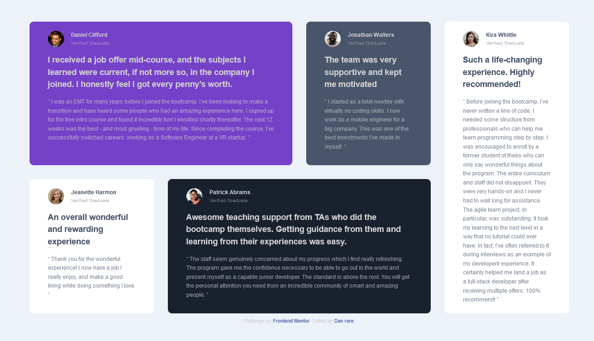

# Frontend Mentor - Testimonials grid section solution

This is a solution to the [Testimonials grid section challenge on Frontend Mentor](https://www.frontendmentor.io/challenges/testimonials-grid-section-Nnw6J7Un7). Frontend Mentor challenges help you improve your coding skills by building realistic projects. 

## Table of contents

- [Overview](#overview)
  - [The challenge](#the-challenge)
  - [Screenshot](#screenshot)
  - [Links](#links)
- [My process](#my-process)
  - [Built with](#built-with)
  - [What I learned](#what-i-learned)
  - [Continued development](#continued-development)
  - [Useful resources](#useful-resources)
- [Author](#author)
- [Acknowledgments](#acknowledgments)


## Overview
Building a testimonial-grid-section of a website. 
### The challenge
The challenge was to build a testimonial grid  section of a website using any tools best known to you, get your testimonial section to look close to the given design, using judgement calls to get the possible height, width, font-size and gap and gettin the section to be responsive depending on users device screen size.

Users should be able to:

- View the optimal layout for the site depending on their device's screen size

### Screenshot




### Links

- Solution URL: [Add solution URL here](https://your-solution-url.com)
- Live Site URL: [Add live site URL here](https://your-live-site-url.com)

## My process
First of all I grouped all the testimonials in to a section (id=testimonials) which served as the parent container and then created a div for each testimonial grid which served as the child container. In each of the child container a div section was created to container the individual profiles (img, name and status) in order to group them and make the layout easy.

Secondly, i set the display property of the parent container (testimonials) to the value grid, using the repeat value created a 12 grid template column layout with a width set to 70px and 2 grid template row with a height set to auto for both row because i wanted the text to determine the height of each child container. Then i created a gutter of about 30px for both row and column using the gap property. The child elements were then given individual fraction in order to span across in the grids in the appropriate section as the design. First child elment (testimonial-1) was given a grid-column property of 1/7, second (testimonial-2) 7/10, third (testimonial-3) 1/4, fourth (testimonial-4) 4/10 and fifth (testimonial-5) a grid-column of 10/13 and a grid-row of 1/3.

Thirdly, the image in the profile section in each of the child container was set to display:left in order to move it to the left and for the text (name and status) to wrap around it. The order texts were given a property of clear:both to prevent them from wrapping around the image. The images are taken out of the flow of the html documents, to correct that they were given a property of overflow: hidden. This ensures the div wrap around it as it was before setting the float property and thus maintaining the layout. The images were then given a margin-right of 15px based on my visual judgement from the design. I also played around with the font-size for the comments(p) (10px), name (h2) (0.75rem), status (p) (11.5px) and intro-text (h1) (1.1rem) to get it to suit the provided design.

Fourthly, I then approach the responsive layouts for mobile since i had started on a large screen that is a desktop first approach. Using mediaqueries i set the max-width to 768px created a 1 grid-template-column with a width of 200px and also a grid-row of 5 with height set to auto. Though this did nothing until i set the grid-column for all child container to span 5 columns and the grid row kept at auto. I also set a break-point of max-width 1220px to create a 2 grid template column, width auto and 3 rows with height auto. I made the fist child span 1/7, for grid column, second 7/ 12, grid column and 2/2 grid row (to push it down), third, 1/7 grid column, fourth, 7/12 and row 1/2 and the fifth, 1/12. 


### Built with

- Semantic HTML5 markup
- CSS custom properties
- CSS Grid
- Mobile-first workflow
- Pesticide
- Chrome developer tools

### What I learned

From the challenge i learned how to use grids effectively and understand how grids works, also it reinforced my ability on making judgment calls using visual guide and help of developer tools when building a website. 


```html
<section> Html5 semantic for creating sections in a web page </section>
```
```css
* {
  padding:0;
  margin:0;
}
html{
  box-sizing:border-box;
}

*, *:before, *after{
    box-sizing: inherit;
}
```

### Continued development

In the future i will like to focus flex-box, responsive design, css arts and css animations 

### Useful resources

- [plurasight](https://www.pluralsight.com/paulcheney) - This helped me for arrangement reason. I really liked this pattern and will use it going forward.
- [w3schools](https://www.w3school.com) - This is an amazing article which helped me finally understand grid. I'd recommend it to anyone still learning this concept.

## Author

- Frontend Mentor - [@Dan rare](https://www.frontendmentor.io/profile/Danrare)
- Twitter - [@Danrare1](https://www.twitter.com/Danrare1)


## Acknowledgments

I want to say a big shout out to Trecia Kat, she was a motivation.

